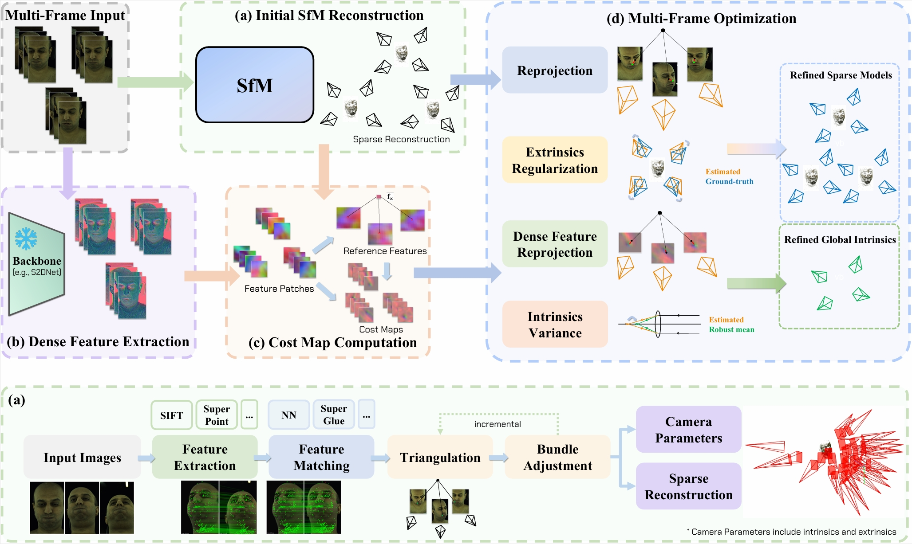

# Multi-Cali Anything

[Jinjiang You](https://yjjfish.github.io/)\*, [Hewei Wang](https://github.com/WangHewei16)\*, Yijie Li, Mingxiao Huo, Long Van Tran Ha, Mingyuan Ma, Jinfeng Xu, Puzhen Wu, Shubham Garg, Wei Pu

[[Website](https://wanghewei16.github.io/Multi-Cali-Anything/)] [[Paper](https://www.arxiv.org/abs/2503.00737)] [[Dataset(*Coming Soon*)]] [[BibTeX](#citing)] [[Gallery](#gallery)]

<div align="center">
  
</div>

**Multi-Cali Anything** is a dense-feature-driven multi-frame camera calibration method designed for large-scale camera arrays. Unlike traditional calibration methods that require dedicated checkerboard captures, our approach directly refines camera intrinsics from scene data, eliminating the necessity for additional calibration captures.

🔍 Why Use This?

 - ✅ No extra calibration captures needed – Uses scene data instead of calibration patterns.
 - ✅ Seamless integration – Works as an add-on to existing SfM pipelines (e.g., COLMAP, Pixel-Perfect SfM).
 - ✅ Dense feature refinement – Reduces keypoint errors for higher calibration accuracy.
 - ✅ Multi-frame optimization – Ensures consistent intrinsics across multiple frames.
 - ✅ Efficient processing - Suitable for large-scale camera arrays with multiple frame captures.
 - ✅ High accuracy - Achieves nearly the same precision as dedicated calibration processes.

🛠 How It Works?

 - 1️⃣ Run any SfM pipeline (COLMAP, Pixel-Perfect SfM, etc.) to obtain initial sparse reconstructions (camera parameters + sparse 3D models).
 - 2️⃣ Use **Multi-Cali Anything** to get refined camera intrinsics and 3D models.

## Installation

We recommend running the project in a docker container. All dependencies will be installed if you build the docker image using our `Dockerfile`.

Git clone the repository to the local machine:

```bash
cd /path/to/your/workspace
git clone https://github.com/YJJfish/Multi-Cali-Anything.git
cd Multi-Cali-Anything
```

Choose the right `CUDA_ARCHITECTURES` for your GPU according to https://developer.nvidia.com/cuda-gpus, and set the value in `Dockerfile`:
```dockerfile
# File: Multi-Cali-Anything/Dockerfile

# TODO: Choose the right CUDA_ARCHITECTURES for your GPU according to https://developer.nvidia.com/cuda-gpus.
# Some versions may not be supported by CUDA 11.7.1. E.g. 89.
ARG CUDA_ARCHITECTURES=86
```

Also set the value in `src/CMakeLists.txt`:

```cmake
# File: Multi-Cali-Anything/src/CMakeLists.txt

set_target_properties(calibration PROPERTIES CUDA_ARCHITECTURES "86")
```

Build a docker image with name `calibration` and tag `1.0`, using the provided `Dockerfile`:

```bash
docker build -t calibration:1.0 .
```

Run a Docker container with the following options:

 - Mount the workspace folder in the host machine to `/home/ubuntu/workspace` in the container.
 - Specify the amount of RAM available to the container (e.g., 16GB) according to your dataset.
 - Specify the amount of shared memory available to the container (e.g., 8GB) according to your dataset.
 - Include GPU support for the container by using `--gpus all`.
```bash
cd /path/to/your/workspace
docker run -dit \
	--name calibration-container \
	-v $(pwd):/home/ubuntu/workspace \
	--memory=16g \
	--shm-size=8g \
	--gpus all \
	calibration:1.0
docker exec -it calibration-container bash
```

Inside the container, use `CMake` to generate the project files and use `make` to compile the project:

```bash
cd /home/ubuntu/workspace/Multi-Cali-Anything/src
mkdir build
cd build
cmake -S .. -B . -DCMAKE_BUILD_TYPE=Release
make
```

## Tutorial

Make sure you are running these commands in the docker container environment.

### Dataset

Download the [Multiface dataset](https://github.com/facebookresearch/multiface) (or its mini-dataset).

```bash
cd /home/ubuntu/workspace
git clone https://github.com/facebookresearch/multiface
cd multiface
python3 download_dataset.py --dest "../mini_dataset/" --download_config "./mini_download_config.json"
```

### Data Preprocessing

Go back to the Multi-Cali Anything repo directory.

```bash
cd /home/ubuntu/workspace/Multi-Cali-Anything
```

The images of Multiface dataset are gathered per camera. However, for SfM applications, images are required to be gathered per frame.

Reorder the dataset images using `script/gather_images.py`:

```bash
mkdir ../E057
python3 script/gather_images.py \
	../mini_dataset/m--20180227--0000--6795937--GHS/images/E057_Cheeks_Puffed \
	../E057/dataset
```

Also copy the KRT (which contains the ground-truth extrinsics) file to the same folder as the reordered dataset.

```bash
cp ../mini_dataset/m--20180227--0000--6795937--GHS/KRT ../E057/KRT
```

Our project functions as an add-on to other SfM pipelines. It uses the sparse reconstruction results of other SfM pipelines and refines the models. We provide `colmap_batch.py` or `pixelsfm_batch.py` to run COLMAP or Pixel-Perfect SfM. We use `pixelsfm_batch.py` as an example:

```bash
python3 script/pixelsfm_batch.py \
	../E057/dataset \
	../E057/pixelsfm
```

Optionally, run `extract_dense_features.py` to extract dense features and store them in database. These features will be used to compute featuremetric costs in our objective function if you enable dense feature refinement.

```bash
python3 script/extract_dense_features.py \
	../E057/dataset \
	../E057/pixelsfm \
	../E057/dense_features.sqlite \
	--mode pixelsfm
```

Finally, run our project:

```bash
./src/build/calibration \
	../E057/pixelsfm \
	../E057/dense_features.sqlite \
	../E057/KRT \
	--mode pixelsfm \
	--output ../E057/output
```

## Citing

If you find our work useful in your research, please consider citing our [paper](https://www.arxiv.org/abs/2503.00737).

```
@article{you2025multicalianything,
title = {Multi-Cali Anything: Dense Feature Multi-Frame Structure-from-Motion for Large-Scale Camera Array Calibration},
author={Jinjiang You and Hewei Wang and Yijie Li and Mingxiao Huo and Long Van Tran Ha and Mingyuan Ma and Jinfeng Xu and Puzhen Wu and Shubham Garg and Wei Pu},
journal={arXiv preprint arXiv:2503.00737},
year={2025}
}
```

## Gallery

Visualization of reprojection errors, using intrinsics produced by different methods.
<div align="center">
  
</div>

Reconstructions by [multi-view stereo](https://github.com/colmap/colmap), using intrinsics produced by different methods. The reconstructions are compared against the ground-truth models, with blue indicating positive distances, red indicating negative distances, green indicating near-zerodeviation.
<div align="center">
  
</div>

Reconstructions by [DUSt3R](https://github.com/naver/dust3r), using intrinsics produced by different methods.
<div align="center">
  
</div>
